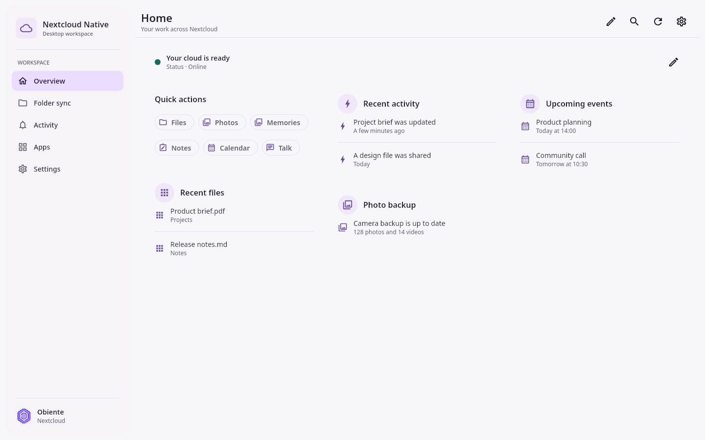
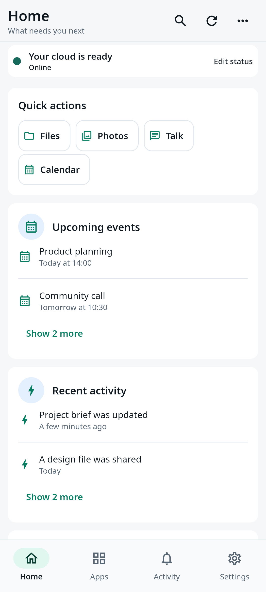
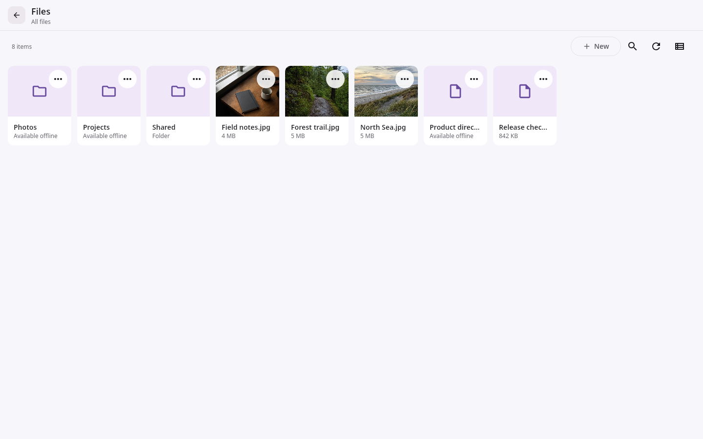
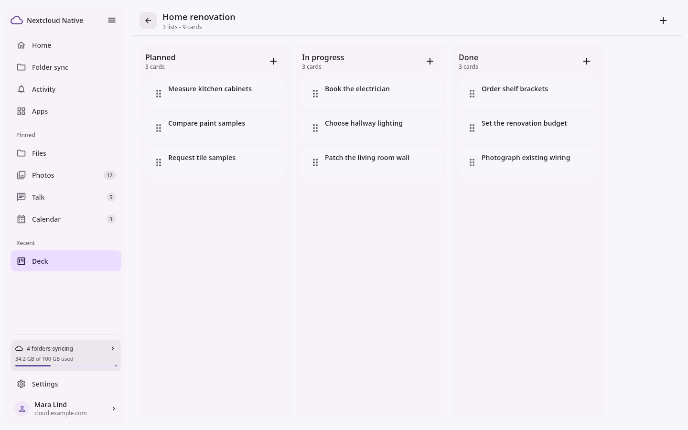
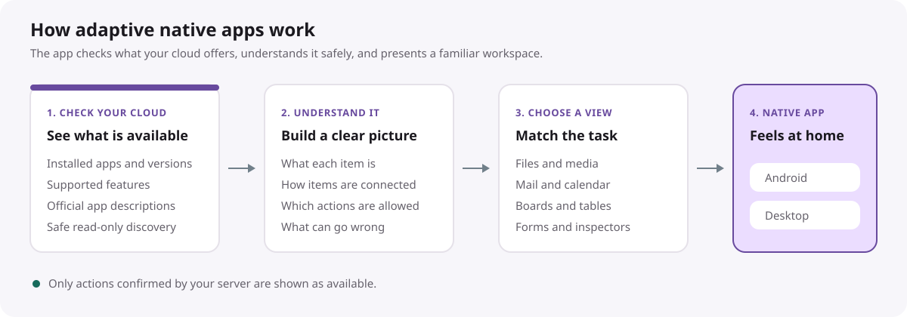

<p align="center">
  
</p>

<h1 align="center">Nextcloud Native</h1>

<p align="center">
  One coherent, native workspace for your whole Nextcloud.
</p>

<p align="center">
  <a href="https://nc-native.obiente.dev">Website</a> ·
  <a href="https://nc-native.obiente.dev/roadmap/">Roadmap</a> ·
  <a href="https://github.com/Obiente/nc-native/releases">Testing releases</a> ·
  <a href="https://github.com/orgs/Obiente/projects/4">GitHub Project</a>
</p>

[](https://github.com/Obiente/nc-native/actions/workflows/ci.yml)
[](LICENSE)

Nextcloud Native is an independent Obiente project for building a fast,
consistent client across Nextcloud Files and installed Nextcloud apps. It
turns verified APIs and data relationships into real native interfaces instead
of embedding remote web pages or exposing raw API responses.

The goal is larger than putting many apps behind one icon. Nextcloud should
feel like one operating-system service:

- files available through native browsers, pickers, sharing, offline access,
  and dependable synchronization;
- photos, videos, RAW files, albums, people, backups, and edits presented as a
  complete media library;
- Talk messages, attachments, notifications, media, and eventually calls using
  platform integrations;
- calendars, contacts, tasks, mail, notes, music, recipes, boards, tables,
  budgets, and other installed apps sharing one interaction language;
- administration, settings, and app management exposed only when permissions
  and authentication make them safe;
- useful native support for previously unseen apps through typed contracts and
  reusable semantic components.

> **Alpha software:** Nextcloud Native is under active development. Current
> prereleases are for testing and contribution, not yet a replacement for every
> production workflow or the only copy of important data.

> **Status snapshot:** Last reviewed: **2026-08-20**. Implementation,
> compatibility, packaging, and release availability may have changed. The
> [GitHub Releases page](https://github.com/Obiente/nc-native/releases) is the
> source of truth for published builds and their known limitations.

Nextcloud Native is unofficial and is not affiliated with, sponsored by, or
endorsed by Nextcloud GmbH.

## Product showcase

These captures come from the real Compose application using deterministic
synthetic fixtures. They demonstrate implemented interface behavior and
responsive layout; they are not evidence that every pictured workflow is
complete on every platform or server version.

<table>
  <tr>
    <td width="68%">
      <picture>
        <source media="(prefers-color-scheme: dark)" srcset="website/public/screenshots/homepage-overview-desktop-dark.png">
        <source media="(prefers-color-scheme: light)" srcset="website/public/screenshots/homepage-overview-desktop-light.png">
        
      </picture>
    </td>
    <td width="32%">
      <picture>
        <source media="(prefers-color-scheme: dark)" srcset="website/public/screenshots/homepage-overview-mobile-dark.png">
        <source media="(prefers-color-scheme: light)" srcset="website/public/screenshots/homepage-overview-mobile-light.png">
        
      </picture>
    </td>
  </tr>
  <tr>
    <td align="center"><strong>Desktop workspace</strong></td>
    <td align="center"><strong>Mobile workspace</strong></td>
  </tr>
</table>

<table>
  <tr>
    <td width="50%">
      <picture>
        <source media="(prefers-color-scheme: dark)" srcset="website/public/screenshots/homepage-files-desktop-dark.png">
        <source media="(prefers-color-scheme: light)" srcset="website/public/screenshots/homepage-files-desktop-light.png">
        
      </picture>
    </td>
    <td width="50%">
      <picture>
        <source media="(prefers-color-scheme: dark)" srcset="website/public/screenshots/homepage-planning-desktop-dark.png">
        <source media="(prefers-color-scheme: light)" srcset="website/public/screenshots/homepage-planning-desktop-light.png">
        
      </picture>
    </td>
  </tr>
  <tr>
    <td align="center"><strong>Files and details</strong></td>
    <td align="center"><strong>Semantic board surface</strong></td>
  </tr>
</table>

## Quick downloads

At the review date, Nightly is the default and only selectable in-app update
track for direct installations.

| Platform | Latest build | Explicit Nightly |
| --- | --- | --- |
| Android 8.0+ | [Download APK](https://nc-native.obiente.dev/d/android-latest) | [Nightly APK](https://nc-native.obiente.dev/d/android-nightly) |
| Linux (Debian/Ubuntu) | [Download DEB](https://nc-native.obiente.dev/d/linux-deb-latest) | [Nightly DEB](https://nc-native.obiente.dev/d/linux-deb-nightly) |
| Linux (Fedora/RHEL) | [Download RPM](https://nc-native.obiente.dev/d/linux-rpm-latest) | [Nightly RPM](https://nc-native.obiente.dev/d/linux-rpm-nightly) |
| Windows x86-64 | [Download MSI](https://nc-native.obiente.dev/d/windows-latest) | [Nightly MSI](https://nc-native.obiente.dev/d/windows-nightly) |
| macOS Intel preview | [Download DMG](https://nc-native.obiente.dev/d/macos-latest) | [Nightly DMG](https://nc-native.obiente.dev/d/macos-nightly) |

The macOS package is a packaging preview and cannot sign in yet. Windows builds
are not Authenticode-signed. See the current release notes for platform-specific
limitations, checksums, and Windows provenance verification.

## Why this project exists

The Nextcloud ecosystem has excellent server apps, but their mobile and desktop
experiences vary. Some have separate clients, some rely on the browser, some
expose only part of their server functionality, and each uses different
navigation and interaction patterns.

Nextcloud Native provides a shared native product layer without reducing every
app to the same generic screen. A table should behave like a table, a deck like
a board, a mailbox like mail, a recipe like something a person can cook from,
and an expense project like a financial workspace. The common layer supplies
identity, permissions, caching, actions, search, settings, navigation, and
platform behavior. Semantic components supply the workflow.

## How adaptive native apps work

<picture>
  <source media="(prefers-color-scheme: dark)" srcset="docs/assets/adaptive-native-architecture-dark.svg">
  <source media="(prefers-color-scheme: light)" srcset="docs/assets/adaptive-native-architecture-light.svg">
  
</picture>

Discovery is deterministic before it is heuristic. The runtime can infer field
roles, relationships, component families, labels, and useful entry points, but
it may not invent an endpoint, payload, permission, resource ID, or retry
guarantee.

Small verified adapters are welcome when they provide meaningful behavior that
cannot be inferred safely. The important distinction is that an adapter
enhances the same typed runtime rather than creating an isolated second app.

See [DYNAMIC_APP_DESCRIPTOR.md](DYNAMIC_APP_DESCRIPTOR.md),
[NATIVE_SCHEMA.md](NATIVE_SCHEMA.md), and
[ADAPTER_ARCHITECTURE.md](ADAPTER_ARCHITECTURE.md) for the trust and execution
boundaries.

## Implemented alpha surfaces

**Last reviewed: 2026-08-20.** Repository implementation may have changed. The
[default branch](https://github.com/Obiente/nc-native/tree/main) is the source of
truth for current code. A listed surface can still have platform, version,
action, or lifecycle limitations and is not a shipped-support guarantee.

The repository already contains runnable Android and Linux desktop
applications with:

- Nextcloud Login Flow v2 with Android Keystore and Linux Secret Service
  credential storage;
- authenticated native Files browsing, list/grid layouts, previews, sharing
  foundations, text editing, and media viewing;
- Photos and Memories collections, albums, tags, people, favorites, RAW/JPEG
  grouping, zoom-gated original loading, and non-destructive edit foundations;
- native Talk history and typed message cards for text, files, recordings,
  calls, system events, and shared objects;
- Notes with folders, ETag-aware writes, and native Markdown edit/preview;
- Activity, global search, Dashboard, user status, and app navigation;
- native semantic flows for Mail, Music, Cookbook, Calendar, Contacts, Tasks,
  Tables, Deck, Cospend, Budget, and administration inventory
  at different levels of completeness;
- capability-driven Office editor choices, embedded Office web pages on Android,
  and a system-browser handoff on desktop. This is web integration, not a native
  Office engine or a claim of verified compatibility with every suite;
- signed-contract acquisition from exact Nextcloud App Store releases plus a
  guarded exact-source fallback for apps that do not advertise a contract;
- shape-driven tables, boards, forms, settings, summaries, charts, collection
  browsers, and detail inspectors that can be reused by unfamiliar apps;
- dark/light/system appearance and responsive shared Compose components;
- deterministic mock services, visible isolated Android emulators, and
  synthetic screenshot generation from the real Compose UI.

This is a meaningful application baseline, not a completeness claim. Some app
surfaces remain read-heavy, some actions still need stronger context binding,
contract discovery and persistent caching need further work, and native UX
quality varies by workflow. The public Project tracks those gaps.

## Planned work

The project is strengthening the foundations required for a dependable daily
client.

| Workstream | What this phase delivers |
| --- | --- |
| Shared foundation | Account-scoped typed transport, SQLite/SQLDelight metadata, stale-while-revalidate repositories, verified contract caching, durable errors, and one identity for the same object across apps |
| Files | Complete browsing and actions, native previews/editors, shares, versions, trash, large folders, resumable transfers, conflicts, and multi-account isolation |
| Sync and offline | Visible upload history, selective offline roots, crash-safe journals and tombstones, Android DocumentsProvider, desktop sync roots, and an Obsidian-grade two-way profile |
| Photos and media | Truthful camera/media backup state, folder preview and destination picking, storage reclaim without hiding media unnecessarily, originals, RAW/video/Live Photos, people workflows, albums, and non-destructive editing |
| DAV and groupware | CardDAV and CalDAV synchronization, native Contacts, Calendar, Tasks, recurrence, sync tokens, and optional operating-system account bridges |
| Talk | Complete messages and attachments first, then push, notifications, system media integration, signaling, and separately gated WebRTC calling |
| Dynamic apps | Faster persistent contract acquisition, relationship-aware navigation, context-bound forms/actions, semantic layouts, and small verified adapters where they genuinely improve the workflow |
| Desktop product | Resizable multi-pane workspaces, keyboard and pointer UX, dense tables, persistent inspectors, desktop file integration, notifications, and update/packaging quality |
| Administration | Native read-only inventory and diagnostics, safe preflight and lifecycle plans, settings generated from verified schemas, and explicit browser/authentication handoff for strict operations |

The dependency gates and data-safety criteria are in
[ROADMAP.md](ROADMAP.md). Live status, priorities, and completed work are in the
[GitHub Project](https://github.com/orgs/Obiente/projects/4).

## Platform status

**Last reviewed: 2026-08-20.** Platform availability may have changed. The
[GitHub Releases page](https://github.com/Obiente/nc-native/releases) is the
source of truth for published artifacts and limitations. This table is not a
stable-support guarantee.

| Platform | Current state |
| --- | --- |
| Android | Active application target with signed APK/AAB prereleases; hosted CI covers unit tests and packaging, while connected-device instrumentation remains separate |
| Linux | Primary interactive desktop development target, distributable plus RPM/DEB prereleases |
| Windows | x86-64 MSI, native Credential Manager login storage, and Cloud Files sync under active prerelease qualification |
| macOS | Early DMG packaging artifact; native Keychain login storage and supported authenticated use are not implemented yet |
| iOS / iPadOS | Planned platform target; no supported launcher is shipped yet |

Android and desktop already share domain models, semantic components, and
product rules. The next-phase architecture moves duplicated transport and
state into shared repositories without requiring the same layout everywhere.
Mobile prioritizes touch, lifecycle, background work, and compact navigation.
Desktop prioritizes multi-pane workflows, keyboard/pointer control, density,
resize behavior, and operating-system file integration.

See [PLATFORMS.md](PLATFORMS.md) for the platform boundary and
[COMPATIBILITY.md](COMPATIBILITY.md) for verified server/app coverage.

## Product and safety principles

- No automatic WebView fallback for installed apps.
- No endpoint, payload, permission, or ID invented by AI or UI inference.
- Reads do not imply writes. Every write needs verified provenance,
  permissions, target identity, validation, conflict behavior, retry policy,
  confirmation, and postcondition recovery.
- Unknown non-idempotent outcomes are visible and reconciled, not blindly
  retried.
- Cached, viewed, available offline, uploaded, and synchronized are distinct
  states.
- Originals are preserved by default. Edits create a new file unless the user
  explicitly chooses a guarded replacement.
- A Login Flow app password is never treated as the primary account password.
- Credentials, share tokens, server URLs, account identifiers, filenames,
  messages, contacts, and other private data stay out of logs, fixtures,
  screenshots, issues, and public artifacts.
- Real-account QA is explicitly authorized and enforced read-only. Write tests
  use disposable synthetic data on an isolated server.
- Previously visited content should appear from cache immediately and refresh
  without throwing away useful state.
- Unsupported behavior is explained honestly instead of presented as a broken
  action.

## Try a prerelease

Testing builds are published on the
[GitHub Releases page](https://github.com/Obiente/nc-native/releases).
Releases remain below `1.0.0` and are marked as prereleases until the published
product, data-loss, security, and platform gates pass.

Android release artifacts are signed with the project's protected release key.
Desktop packages are provided per successful platform build. Windows MSI
packages use native Credential Manager storage, include keyless GitHub build
provenance, and are currently unsigned, so SmartScreen may require choosing
`More info > Run anyway`. macOS packages still prove packaging only and do not
yet have native Keychain login integration.
Read each release's known limitations before installing over an existing test
build.

## Build from source

Requirements:

- JDK 21;
- Rust stable;
- Android SDK Platform 36 and Build Tools 35.0.0 for Android builds.

Use `ANDROID_HOME` or `ANDROID_SDK_ROOT` for your own SDK installation. Do not
commit `local.properties` or a home-directory path.

```bash
git clone https://github.com/Obiente/nc-native.git
cd nc-native

cargo test --locked
./gradlew --no-daemon :ui:desktopTest
./gradlew --no-daemon :ui:createDistributable
./gradlew --no-daemon :androidApp:assembleDebug
bash tools/check-repository.sh
```

For a locally signed app that installs alongside release and nightly builds, use the dedicated
development variant:

```bash
./tools/deploy-android-dev.sh
```

It installs as `dev.obiente.nextcloudnative.dev` with the label `Nextcloud Native Dev`, so local
testing never replaces the signed `dev.obiente.nextcloudnative` package.

The Gradle wrapper pins Gradle itself, and the project build targets JDK 21.
Build and test jobs are path-filtered where appropriate so documentation-only
changes do not rebuild unrelated application targets.

For the complete local test matrix, isolated visible Android emulators, optional
read-only session reuse, and device deployment, read
[CONTRIBUTING.md](CONTRIBUTING.md).

## Repository map

| Path | Purpose |
| --- | --- |
| `src/` and `tests/` | Rust semantic compiler, schema model, inference, and contract tests |
| `contractAcquisition/` | Exact-version signed package and source contract acquisition |
| `ui/` | Shared Compose domain UI plus Android/desktop implementations |
| `androidApp/` | Android launcher and platform integrations |
| `website/` | Self-hosted project site, news, public roadmap, and synthetic real-UI screenshots |
| `tools/` | Repository checks, deployment, emulators, screenshots, and release validation |
| `docs/` | Release notes and operational documentation |

Architecture and protocol references:

- [Product and engineering roadmap](ROADMAP.md)
- [Adapter and transport architecture](ADAPTER_ARCHITECTURE.md)
- [Dynamic App Descriptor](DYNAMIC_APP_DESCRIPTOR.md)
- [Native Schema](NATIVE_SCHEMA.md)
- [Platform strategy](PLATFORMS.md)
- [Compatibility matrix](COMPATIBILITY.md)
- [Linux package repositories](docs/linux-package-repositories.md)
- [Changelog](CHANGELOG.md)
- [Security policy](SECURITY.md)

## Contributing

Contributions are welcome, especially:

- reusable semantic components and relationship inference;
- Files, DAV, sync, media, Talk, and platform integration work;
- protocol research backed by official upstream sources;
- versioned compatibility fixtures and mock-server tests;
- accessibility, responsive desktop/mobile UX, and performance improvements;
- translations, documentation, packaging, and deterministic visual QA.

Start with an issue or a focused item in the
[public Project](https://github.com/orgs/Obiente/projects/4). A small
app-specific adapter is appropriate when it provides verified behavior that
cannot be inferred safely. It should still reuse shared models, actions, state,
and components.

Read [CONTRIBUTING.md](CONTRIBUTING.md) and [AGENTS.md](AGENTS.md) before
changing implementation behavior. AI-assisted contributions must remain
human-led and accountable; disclosure is appreciated but optional. See
[AI_POLICY.md](AI_POLICY.md).

Report security issues privately through
[GitHub private vulnerability reporting](https://github.com/Obiente/nc-native/security/advisories/new).

## License and trademark

Nextcloud Native is licensed under the
[GNU Affero General Public License, version 3 or later](LICENSE).

"Nextcloud" is a trademark of Nextcloud GmbH. This independent Obiente project
is not affiliated with, sponsored by, or endorsed by Nextcloud GmbH.
