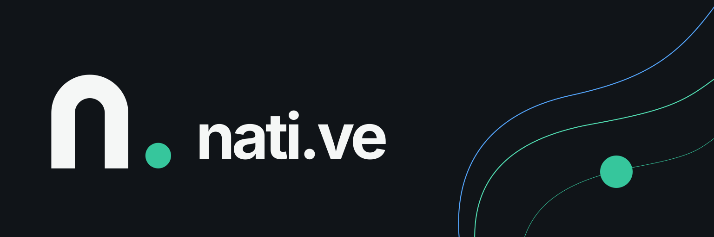
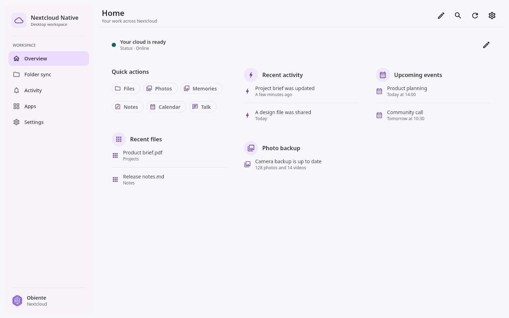
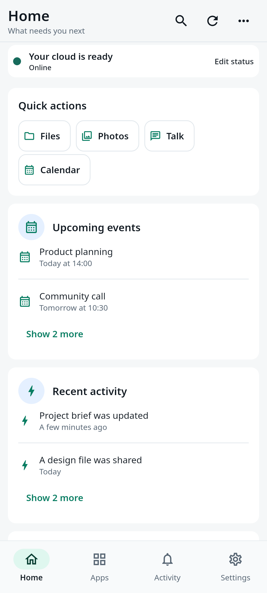
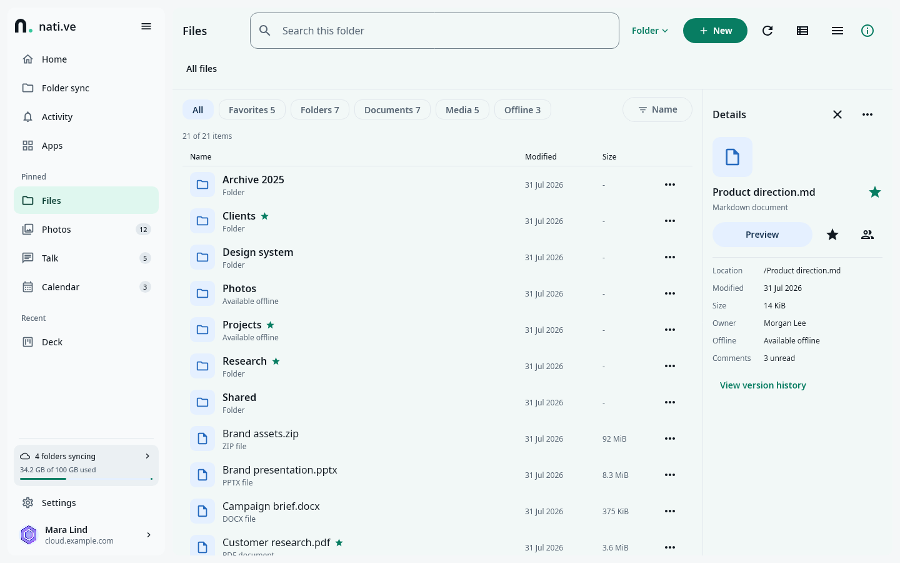
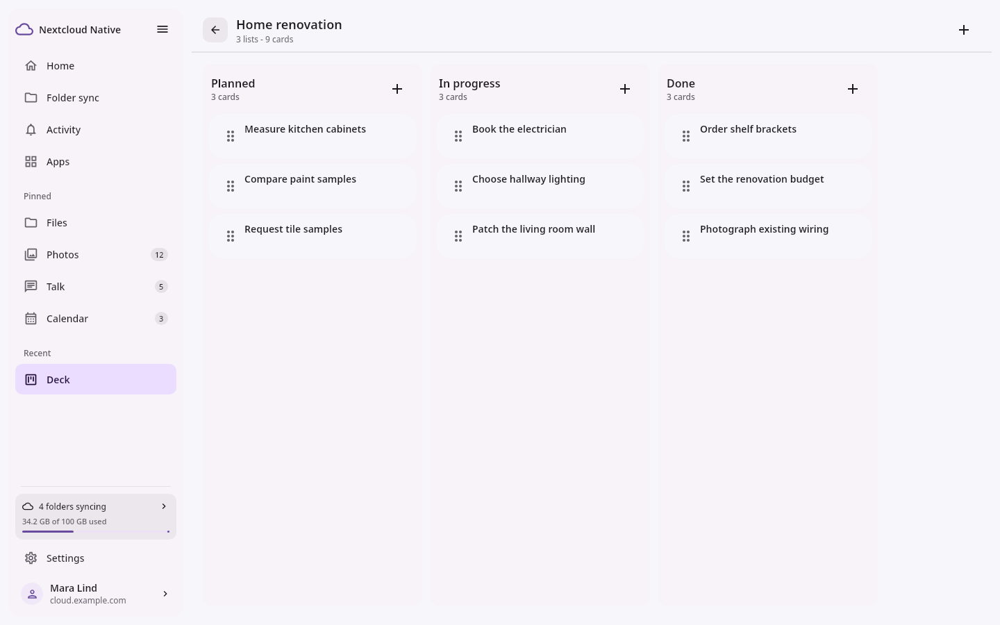
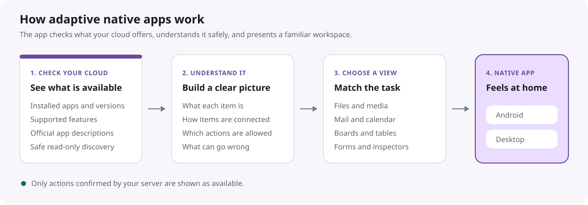

<p align="center">
  
</p>

<h1 align="center">nati.ve: one app for your Nextcloud account</h1>

<p align="center">Browse files and photos, read Talk conversations, and use your calendar on Android, Linux and Windows.</p>

<p align="center">
  <a href="https://nati.ve">Website</a> ·
  <a href="https://nati.ve/roadmap/">Roadmap</a> ·
  <a href="https://github.com/obiente/native/releases">Testing releases</a>
</p>

[](https://github.com/obiente/native/actions/workflows/ci.yml)
[](LICENSE)

nati.ve is a free, open-source app for your phone or computer. It connects to
an existing Nextcloud account.

Nextcloud is software that hosts files, photos, calendars and other services
on a server that you or your provider runs. To use nati.ve you need that
server's address and an account on it. nati.ve does not provide cloud storage
and does not replace your server.

With nati.ve you can, for example, open a document from Nextcloud Files,
browse a photo album, read a Talk conversation and check your calendar in one
app. You do not need to switch between separate clients or browser tabs.
nati.ve draws its own screens for these tasks and works with the same data on
your server.

> **Alpha software.** nati.ve is under active development. Testing builds are
> for trying the app and for contributors. Do not rely on it as your only
> client for important work or as the only copy of important data.

nati.ve is an independent Obiente project. It is not affiliated with,
sponsored by, or endorsed by Nextcloud GmbH.

## What works today

The alpha includes file browsing and previews, photo browsing, Talk history,
Calendar and Notes. Other Nextcloud apps have varying levels of support.
Installing an app on your server does not mean that all of its features work
in nati.ve.

Before you rely on a workflow, check the
[compatibility details](COMPATIBILITY.md) and the known limitations in the
[release notes](https://github.com/obiente/native/releases). The longer list
under [Implemented alpha surfaces](#implemented-alpha-surfaces) describes the
source code in more detail. [Planned work](#planned-work) is listed separately.

## Install

Start with a setup guide:

- [Android setup guide](https://nati.ve/guides/android/getting-started/)
- [Linux and Windows setup guide](https://nati.ve/guides/desktop/getting-started/)

### Quick downloads

**Last reviewed: 2026-10-02.** Release channels and published packages may
have changed. The [GitHub Releases page](https://github.com/obiente/native/releases)
is the source of truth for published builds, checksums and known limitations.

At the review date, Nightly is the only update channel you can select in the
app. These links always point to the newest Nightly build.

| Platform | Download |
| --- | --- |
| Android 8.0 or newer | [APK](https://nati.ve/d/android-latest) |
| Linux (Debian, Ubuntu) | [DEB](https://nati.ve/d/linux-deb-latest) |
| Linux (Fedora, RHEL) | [RPM](https://nati.ve/d/linux-rpm-latest) |
| Windows x86-64 | [MSI](https://nati.ve/d/windows-latest) |
| macOS Intel (packaging preview) | [DMG](https://nati.ve/d/macos-latest) |

Things to know before installing:

- **All builds are prereleases.** Versions stay below `1.0.0` until the
  product, data-safety, security and platform gates pass. Read each release's
  known limitations before you install over an existing test build.
- **Android** builds are signed with the project's protected release key.
- **Windows** MSI packages are not Authenticode-signed. SmartScreen may warn
  before installation; after you confirm the file came from the project's
  GitHub release, choose `More info > Run anyway`. Each MSI has GitHub build
  provenance you can verify. See
  [Windows MSI qualification](docs/windows-release.md).
- **macOS** packages are an early packaging preview. Keychain storage is
  covered by source tests, but signing in has not been validated on a real
  Mac.

## Product showcase

These pictures come from the real app, running with made-up test data. They
show the interface and its responsive layout. They do not prove that every
pictured workflow is complete on every platform or server version.

<table>
  <tr>
    <td width="68%">
      <picture>
        <source media="(prefers-color-scheme: dark)" srcset="website/public/screenshots/homepage-overview-desktop-dark.png">
        <source media="(prefers-color-scheme: light)" srcset="website/public/screenshots/homepage-overview-desktop-light.png">
        
      </picture>
    </td>
    <td width="32%">
      <picture>
        <source media="(prefers-color-scheme: dark)" srcset="website/public/screenshots/homepage-overview-mobile-dark.png">
        <source media="(prefers-color-scheme: light)" srcset="website/public/screenshots/homepage-overview-mobile-light.png">
        
      </picture>
    </td>
  </tr>
  <tr>
    <td align="center"><strong>Desktop workspace</strong></td>
    <td align="center"><strong>Mobile workspace</strong></td>
  </tr>
</table>

<table>
  <tr>
    <td width="50%">
      <picture>
        <source media="(prefers-color-scheme: dark)" srcset="website/public/screenshots/homepage-files-desktop-dark.png">
        <source media="(prefers-color-scheme: light)" srcset="website/public/screenshots/homepage-files-desktop-light.png">
        
      </picture>
    </td>
    <td width="50%">
      <picture>
        <source media="(prefers-color-scheme: dark)" srcset="website/public/screenshots/homepage-planning-desktop-dark.png">
        <source media="(prefers-color-scheme: light)" srcset="website/public/screenshots/homepage-planning-desktop-light.png">
        
      </picture>
    </td>
  </tr>
  <tr>
    <td align="center"><strong>Files and details</strong></td>
    <td align="center"><strong>Semantic board surface</strong></td>
  </tr>
</table>

## Why this project exists

Nextcloud has excellent server apps, but their mobile and desktop experiences
vary. Some have their own client, some only work in the browser, and some
expose only part of what the server can do. Each one looks and behaves
differently.

nati.ve adds one shared native layer on top, without forcing every app into
the same generic screen. A table should behave like a table, a deck like a
board, a mailbox like mail, a recipe like something you can cook from, and an
expense project like a budget. The shared layer handles sign-in, permissions,
caching, actions, search, settings, navigation and platform behavior. Each
kind of content gets a component built for its workflow.

## How adaptive native apps work

<picture>
  <source media="(prefers-color-scheme: dark)" srcset="docs/assets/adaptive-native-architecture-dark.svg">
  <source media="(prefers-color-scheme: light)" srcset="docs/assets/adaptive-native-architecture-light.svg">
  
</picture>

nati.ve learns what a server app offers from verified sources first, such as
published API contracts. Only then does it use heuristics. It may guess field
roles, relationships, labels and a good starting screen. It may never invent
an endpoint, request body, permission, resource ID or retry guarantee.

Small, verified adapters for a specific app are welcome when they add useful
behavior that cannot be inferred safely. An adapter extends the same shared
runtime; it does not become a separate app inside the app.

The trust and execution rules are in
[DYNAMIC_APP_DESCRIPTOR.md](DYNAMIC_APP_DESCRIPTOR.md),
[NATIVE_SCHEMA.md](NATIVE_SCHEMA.md) and
[ADAPTER_ARCHITECTURE.md](ADAPTER_ARCHITECTURE.md).

## Implemented alpha surfaces

**Last reviewed: 2026-09-01.** The code may have changed since then. The
[default branch](https://github.com/obiente/native/tree/main) is the source of
truth. A listed surface can still have platform, version, action or lifecycle
limitations. Being listed here does not mean it is supported for normal use.

The repository contains runnable Android and desktop applications (Linux,
Windows, and an early macOS package) with:

- Nextcloud Login Flow v2, with credentials kept in Android Keystore, Linux
  Secret Service or Windows Credential Manager. macOS Keychain storage exists
  in source and is covered by deterministic tests;
- Files: browsing, list and grid layouts, previews, sharing foundations, text
  editing and media viewing;
- Photos and Memories: collections, albums, tags, people, favorites, RAW and
  JPEG grouping, full-quality originals loaded on zoom, and foundations for
  edits that keep the original;
- Talk history, with message cards for text, files, recordings, calls, system
  events and shared objects;
- Notes, with folders, ETag-aware saving and Markdown editing and preview;
- Activity, global search, Dashboard, user status and app navigation;
- native flows for Mail, Music, Cookbook, Calendar, Contacts, Tasks, Tables,
  Deck, Cospend, Budget and administration inventory, at different levels of
  completeness;
- an Office document browser with editor choices based on server
  capabilities. Android embeds only the chosen document's editing session;
  desktop hands it to the system browser. This is web integration, not a
  native Office engine, and not verified against every Office suite;
- contract acquisition from signed, exact-version Nextcloud App Store
  releases, plus a guarded fallback to the exact source release for apps that
  do not publish a contract;
- reusable tables, boards, forms, settings, summaries, charts, collection
  browsers and detail inspectors for apps nati.ve has not seen before;
- dark, light and system appearance, with responsive shared Compose
  components;
- deterministic mock services, isolated visible Android emulators, and
  screenshots generated from the real Compose UI with synthetic data.

This is a solid baseline, not a finished product. Some apps are still mostly
read-only. Some actions need stronger binding to the item they act on. Contract
discovery and persistent caching need more work, and native UX quality varies
by workflow. The [public Project](https://github.com/orgs/Obiente/projects/4)
tracks these gaps.

## Planned work

The project is strengthening the foundations a dependable daily client needs.

| Workstream | What this phase delivers |
| --- | --- |
| Shared foundation | Account-scoped typed transport, SQLite/SQLDelight metadata, stale-while-revalidate repositories, verified contract caching, durable errors, and one identity for the same object across apps |
| Files | Complete browsing and actions, native previews/editors, shares, versions, trash, large folders, resumable transfers, conflicts, and multi-account isolation |
| Sync and offline | Visible upload history, selective offline roots, crash-safe journals and tombstones, Android DocumentsProvider, desktop sync roots, and an Obsidian-grade two-way profile |
| Photos and media | Truthful camera/media backup state, folder preview and destination picking, storage reclaim without hiding media unnecessarily, originals, RAW/video/Live Photos, people workflows, albums, and non-destructive editing |
| DAV and groupware | CardDAV and CalDAV synchronization, native Contacts, Calendar, Tasks, recurrence, sync tokens, and optional operating-system account bridges |
| Talk | Complete messages and attachments first, then push, notifications, system media integration, signaling, and separately gated WebRTC calling |
| Dynamic apps | Faster persistent contract acquisition, relationship-aware navigation, context-bound forms/actions, semantic layouts, and small verified adapters where they genuinely improve the workflow |
| Desktop product | Resizable multi-pane workspaces, keyboard and pointer UX, dense tables, persistent inspectors, desktop file integration, notifications, and update/packaging quality |
| Administration | Native read-only inventory and diagnostics, safe preflight and lifecycle plans, settings generated from verified schemas, and explicit browser/authentication handoff for strict operations |

[ROADMAP.md](ROADMAP.md) has the dependency order and data-safety gates. The
[GitHub Project](https://github.com/orgs/Obiente/projects/4) has live status,
priorities and completed work.

## Platform status

**Last reviewed: 2026-09-01.** Platform availability may have changed. The
[GitHub Releases page](https://github.com/obiente/native/releases) is the
source of truth for published artifacts and limitations. This table is not a
promise of stable support.

| Platform | State |
| --- | --- |
| Android | Main mobile target. Signed APK and AAB prereleases. Hosted CI runs unit tests and packaging; connected-device tests run separately |
| Linux | Main desktop development target. App image plus RPM and DEB prereleases |
| Windows | x86-64 MSI with Credential Manager sign-in storage and Cloud Files sync, in prerelease qualification |
| macOS | Early DMG packaging artifact. Keychain storage is source-tested, but authenticated use has not been live-validated |
| iOS / iPadOS | Planned. No app is shipped yet |

Android and desktop share domain models, semantic components and product
rules, but not identical layouts. Mobile focuses on touch, lifecycle,
background work and compact navigation. Desktop focuses on multi-pane
workflows, keyboard and pointer control, dense layouts, resizing and
operating-system file integration.

See [PLATFORMS.md](PLATFORMS.md) for what is shared and what is
platform-specific, and [COMPATIBILITY.md](COMPATIBILITY.md) for verified
server and app coverage.

## Product and safety principles

- Installed apps never fall back to an embedded web page automatically.
- AI or UI inference never invents an endpoint, request body, permission or ID.
- Being able to read something does not allow writing it. Every write needs a
  verified source, permissions, the exact target, validation, conflict
  handling, a retry policy, confirmation and a way to recover.
- If the result of a non-repeatable action is unknown, nati.ve shows that and
  checks the server. It does not blindly retry.
- "Cached," "viewed," "available offline," "uploaded" and "synchronized" are
  different states and are never used as synonyms.
- Originals are kept by default. Edits create a new file unless you choose a
  guarded replacement.
- A Login Flow app password is never treated as your main account password.
- Credentials, share tokens, server URLs, account IDs, filenames, messages,
  contacts and other private data stay out of logs, fixtures, screenshots,
  issues and public artifacts.
- Testing against a real account requires explicit permission and is enforced
  read-only. Write tests use disposable synthetic data on an isolated server.
- Content you opened before appears from the cache right away and refreshes in
  place.
- Unsupported behavior is explained honestly, not shown as a broken button.

## Build from source

You need JDK 21, Rust stable, and, for Android, the Android SDK with
Platform 36 and Build Tools 35.0.0. Point `ANDROID_HOME` or `ANDROID_SDK_ROOT`
at your SDK. Never commit `local.properties` or a home-directory path.

```bash
git clone https://github.com/obiente/native.git
cd native

./gradlew :ui:run                      # start the desktop app from source
./gradlew :androidApp:assembleDev      # build an Android APK that installs beside release builds
./gradlew --no-daemon :ui:desktopTest  # run the shared and desktop tests
bash tools/check-repository.sh         # run repository checks
```

The Android `dev` build type installs as `dev.obiente.nextcloudnative.dev`
with the label `nati.ve Dev`, so it never replaces the signed
`dev.obiente.nextcloudnative` app.

[CONTRIBUTING.md](CONTRIBUTING.md) has the full quick start, the test matrix,
isolated Android emulators, device deployment and troubleshooting.

## Repository map

| Path | Purpose |
| --- | --- |
| `ui/` | Shared Compose Multiplatform UI and domain code (`commonMain`, `jvmMain`), Android library code and the desktop JVM app |
| `androidApp/` | Android application: launcher, build types and platform integrations |
| `contractAcquisition/` | Exact-version signed package and source contract acquisition (JVM) |
| `src/` and `tests/` | Rust reference compiler and schema subset with contract tests; `src/bin/` holds the Windows Explorer registration helper |
| `integration/` | Disposable [Nextcloud compatibility instance](integration/nextcloud-demo/README.md) with synthetic data |
| `server-companion/` | Optional [server apps](server-companion/README.md) that add narrow capabilities |
| `release/` | Public release inputs: Android signing-certificate digest, Linux AppStream and packaging templates, and a prerelease update-contract fixture |
| `changes/` | [Changelog fragments](changes/README.md) for unreleased and archived releases |
| `design/` | [Brand and icon sources](design/README.md) |
| `website/` | Project [website](website/README.md), guides, news and synthetic real-UI screenshots |
| `tools/` | Repository checks, deployment, emulators, screenshots and release validation |
| `docs/` | Operational and release documentation; start at the [documentation index](docs/README.md) |

Architecture and protocol references:

- [Product and engineering roadmap](ROADMAP.md)
- [Adapter and transport architecture](ADAPTER_ARCHITECTURE.md)
- [Dynamic App Descriptor](DYNAMIC_APP_DESCRIPTOR.md)
- [Native Schema](NATIVE_SCHEMA.md)
- [Platform strategy](PLATFORMS.md)
- [Compatibility matrix](COMPATIBILITY.md)
- [Linux package repositories](docs/linux-package-repositories.md)
- [Changelog](CHANGELOG.md)
- [Security policy](SECURITY.md)

## Contributing

Contributions are welcome, especially:

- reusable semantic components and relationship inference;
- Files, DAV, sync, media, Talk and platform integration;
- protocol research backed by official upstream sources;
- versioned compatibility fixtures and mock-server tests;
- accessibility, responsive desktop and mobile UX, and performance;
- translations, documentation, packaging and deterministic visual QA.

Start with an issue or a focused item in the
[public Project](https://github.com/orgs/Obiente/projects/4). A small
app-specific adapter is fine when it adds verified behavior that cannot be
inferred safely; it should still reuse shared models, actions, state and
components.

Read [CONTRIBUTING.md](CONTRIBUTING.md) and [AGENTS.md](AGENTS.md) before
changing how the app behaves. AI-assisted contributions must stay human-led
and accountable. Disclosure is appreciated but optional; see
[AI_POLICY.md](AI_POLICY.md).

Report security issues privately through
[GitHub private vulnerability reporting](https://github.com/obiente/native/security/advisories/new).
See the [security policy](SECURITY.md).

## License and trademark

nati.ve is licensed under the
[GNU Affero General Public License, version 3 or later](LICENSE).

"Nextcloud" is a trademark of Nextcloud GmbH. This independent Obiente project
is not affiliated with, sponsored by, or endorsed by Nextcloud GmbH.
